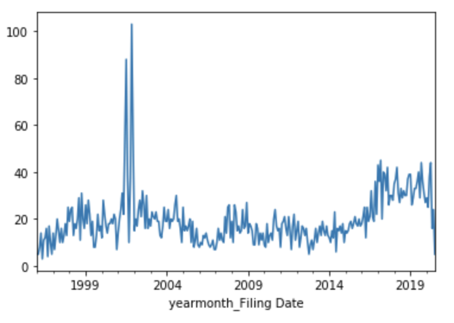

## Securities Class Action

[<< Back to my website](https://zycalice.github.io/)

This is an interesting analysis looking at securities class action litigations. A security class action is a special type of class action with regards to stocks. For example, a company knew of a potential risk but did not disclose it to the shareholders through press releases or filings. During this period, the stock price was artificially high. Due to this reason, the shareholders who bought the shares during this period and did not sell before the risk is revealed are entitled to claim damages. In securities law, this corresponds to section 10b-5 or section 11.

Stanford University has a well-established [database](http://securities.stanford.edu/filings.html). 

1.) The first part of this project is to establish a scrapping pipeline using Scrapy to scrape the main table (main link) and individual case information (information from case sublinks, including court document pdfs) under individual case links. This step is done and data are saved in both csv and json formats.

There are 5,771 cases scraped (as of 07/12/2020) for the main table and individual case information.
There are 5,254 cases with documents under "First Identified Complaints". All 16,727 documents in pdf form are downloaded.
  
2.) The second part is to provide a descriptive analysis of recent trends and interesting insights into these 5,771 cases. Stanford University has also provided some such analysis. This step is preliminary and still in process. Several observations:

Biotech and software have the highest number of cases, showing how innovation and research are not very predictable and information released to the public might not be accurate in the public eye.

  

S.D. New York District Court has the most cases (1,406) and this is way more than the second winner which is N.D. California (565). The third is C.D. California (373).

  

Over the years, the number of securities class action spiked in 2001 (using date filed), and went down probably due to the economic downturn. Starting in 2012, the number of cases filed steadily increased.

  

    
3.) The third part is to apply several NLP methods to the documents under "First Identified Complaints".
  -Topic modeling using the complaints.
  -Potential text summarization using Stanford summary paragraphs as labels.
  -Other potential analysis.

Stay in tune for more information!
